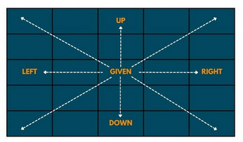
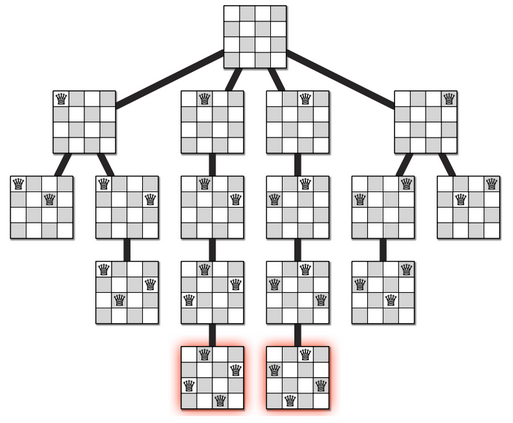
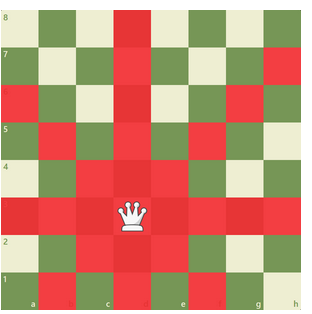

# N-Queens

## Day 1

### Problem

N queens must be placed on a NxN chessboard so that no queen can attack any other queen. The queen moves in 8 directions and can directly attack in these 8 directions only.



Remember, you may place only 1 queen in each row, column, diagonal. 



Based on this logic, we do not care about threatened spots if they are in the same row or higher.




- How would you solve this problem with recursive backtracking? Would you duplicate the entire board each time you make the recursive call?

- How could you place the queens on the board making sure no queens will attach each other?

- How can you indicate if a position on the board is safe to add a queen?

- Write a detailed pseudocode for the methods addQueen(...) and removeQueen(...)

- You may represent a queen with -1. Safe spots with 0. Threatened spots >= 1.

### Methods that could be added to your code

```
/**
*@return true when the queen added correctly, false Otherwise
*@precondition r and c are valid indices of the board array
*@postcondition the board is only changed when the function returns true
* in which case the queen is added and all it's threatened positions are incremented.
*/
private boolean addQueen(...){

}

/**Remove the queen that was added to r,c
*@precondition r and c are valid indices of the board array and there is a queen at position r,c
*@postcondition the board is modified to remove that queen and all it's
*threatened positions are decremented
*/
private void removeQueen(...){

}
```

Respond to the questions here:  `.../APCSA_1/apcsa-assignments-YourUsername/classwork/39_NQueens/answers.txt (or md, docx, pdf)`

Write the pseudocode here:  `.../APCSA_1/apcsa-assignments-YourUsername/classwork/39_NQueens/pseudocode.txt (or md, docx, pdf)`
